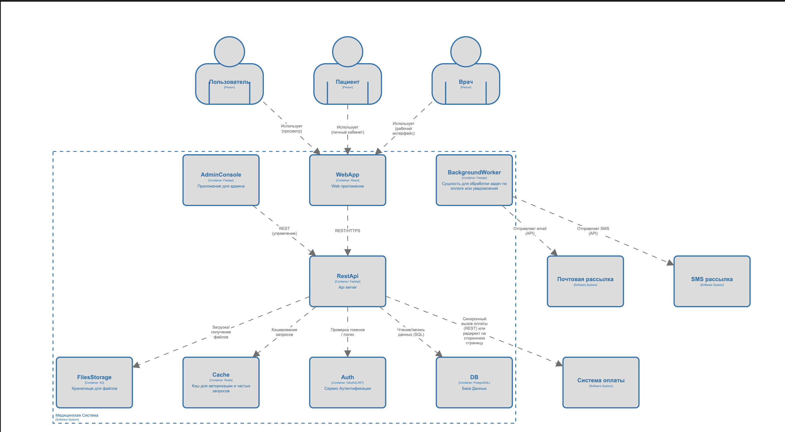

# Фоменков Макар Никитич ВАР20

тз:

# Решение:
1) Предположительные роли, что будут пользоваться системой: Роль пользователя, Роль пациента, Роль врача, Роль админа
 - Пользователь - неавторизованное лицо 
 - Пациент - авторизованное лицо 
 - Врач - авторизованное лицо под специальной учеткой имеет чуть больше прав
 - Админ - авторизованное лицо с админскими правами

2) Возможные внешние системы для интеграций:
 - sms рассылка
 - email рассылка
 - Система оплаты (онлайн касса)

3) С1

4) USE CASES
- UC-1: Просмотр услуг (Пользователь) \
Актор: Пользователь (неавторизованное лицо) \
Что: Просмотр страницы с услугами и докторами \
Приоритет: Обязательный

- UC-2: Регистрация аккаунта (Пользователь -> Пациент) \
Актор: Пользователь (неавторизованное лицо) -> Пациент \
Что: Регистрация аккаунта с автоматическим созданием медкарты \
Приоритет: Обязательный

- UC-3: Авторизация (Login) \
Актор: User -> Patient/Doctor/Admin\
Что: Авторизация пользователя через логин и паполь для присвоения роли \
Приоритет: Обязательный

- US-4: Поиск пользователя по логину \
Актор: Doctor/Admin/Patient (пациент может искать аккаунты врачей) \
Что: Поиск через ui по логину/маске имени и фамилии \
Приоритет: Обязательный

- US-5: Поиск пациента по ФИО \
Актор: Doctor/Admin \
Что: Поиск пациента для получения всей информации по нему по его ФИО \
Приоритет: Обязательный

- US-6: Создание мед записи в мед книжке \
Актор: Doctor -> Patient \
Что: Создать запись (диагноз, назначение, код записи) + возможность прикрепить файлы (опционально) \
Приоритет: Обязательный

- US-7: Добавление записи к пациенту \
Актор: Doctor -> Patient \
Что: Привязать запись к пациенту \
Приоритет: Обязательный 

- US-8: Получение истории записей пациента \
Актор: Doctor -> Patient \
Что: Просмотр хронологии медицинских записей. \
Приоритет: Обязательный

- US-9: Получение записи по коду
Актор: Doctor \
Что: Поиск и получение конкретной записи по её коду/ID.\
Приоритет: Обязательный

- US-10: Запись на прием
Актор: Doctor/Patient \
Что: Выбрать врача/время и дату приема, оплатить по необходимости, получить уведомление \
Приоритет: Обязательный

- US-11: Уведомления (email/SMS) о приёме/результатах \
Актор: MedicineSystem -> EmailService|SMSService -> Patient \
Что: Отправка напоминаний и уведомлений \
Приоритет: Обязательный

- US-12: Управление пользователями и ролями \
Актор: Admin \
Что: Блокировка, выдача прав, удаление ролей \
Приоритет: Обязательный

- US-13: Интеграция оплаты \
Актор: MedicineSystem -> PaymentSystem -> Patient \
Что: Оплата платных услуг через внешнюю систему. \
Приоритет: Обязательный

5) С2
