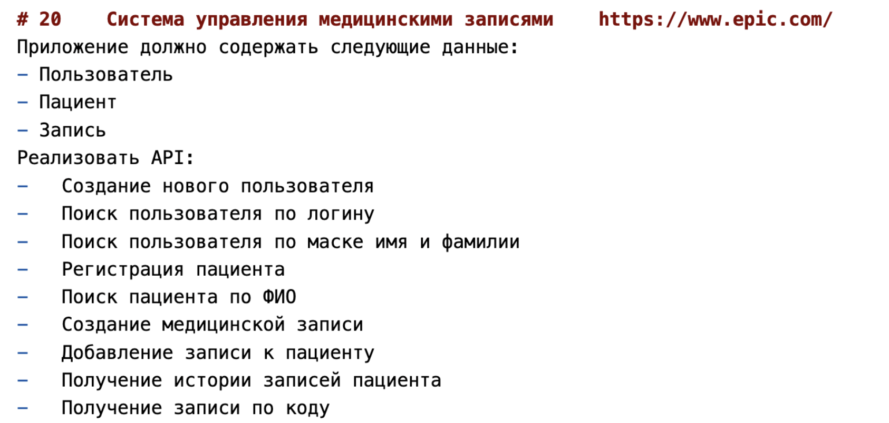
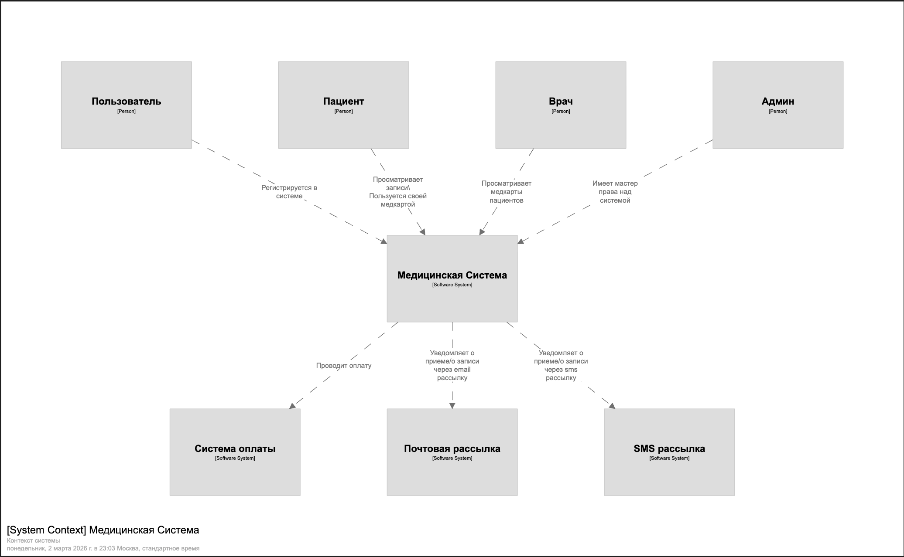

# Фоменков Макар Никитич ВАР20

тз:

# Решение:
1) Предположительные роли, что будут пользоваться системой: Роль пользователя, Роль пациента, Роль врача, Роль админа
 - Пользователь - неавторизованное лицо 
 - Пациент - авторизованное лицо 
 - Врач - авторизованное лицо под специальной учеткой имеет чуть больше прав
 - Админ - авторизованное лицо с админскими правами

2) Возможные внешние системы для интеграций:
 - sms рассылка
 - email рассылка
 - Система оплаты (онлайн касса)

3) 
