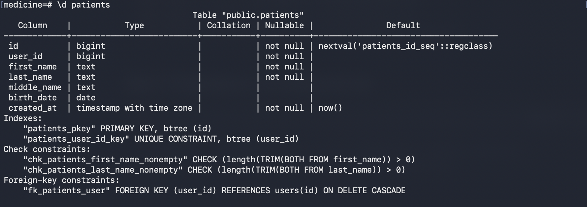
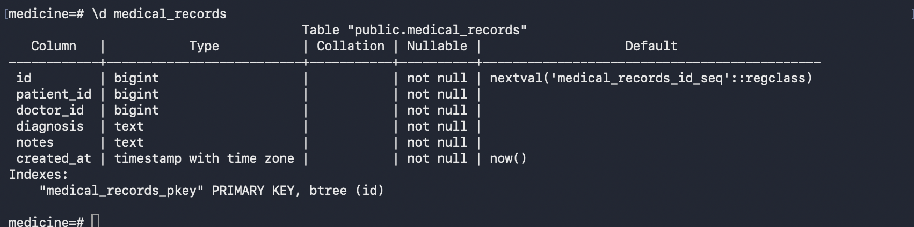
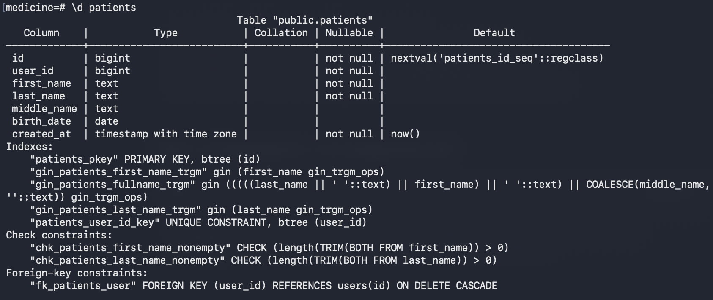
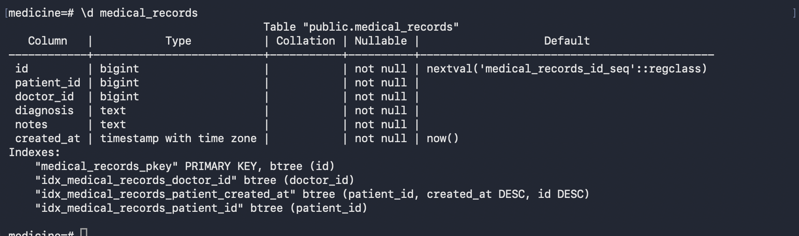

# optimization.md

## 1. Частые запросы в системе

1) Поиск пациента по маске ФИО (`ILIKE '%...%'`)
2) История медицинских записей пациента:
   - `WHERE patient_id = ? ORDER BY created_at DESC LIMIT/OFFSET`
3) Получение записи по id (`WHERE id = ?`)
4) Поиск пользователя по логину (`WHERE email = ?`)
5) JOIN users<->patients при поиске “пользователей по ФИО”

---

## 2. Индексы и зачем они нужны

### `users`
- `UNIQUE(email)`  
  Нужен для быстрого поиска по логину/email и для запрета дублей.

### `patients`
- `UNIQUE(user_id)`  
  1 профиль пациента на 1 пользователя, плюс ускорение JOIN `patients.user_id = users.id`.
- `GIN ... gin_trgm_ops` на `first_name`, `last_name` и выражение полного ФИО  
  Нужен для ускорения запросов `ILIKE '%mask%'` по ФИО.

### `medical_records`
- `idx_medical_records_patient_id`  
  Ускоряет фильтрацию `WHERE patient_id = ?`.
- `idx_medical_records_doctor_id`  
  Ускоряет запросы по врачу (если появятся).
- `idx_medical_records_patient_created_at (patient_id, created_at desc, id desc)`  
  Критично для истории пациента: позволяет читать записи уже в нужном порядке, без сортировки по всей таблице.

---

## 3. Оптимизация: поиск пациента по маске ФИО

### Состояние "до"




### Состояние "после"




### Запрос
```sql
EXPLAIN (ANALYZE, BUFFERS)
SELECT p.id, p.user_id, u.email, p.first_name, p.last_name, p.middle_name
FROM patients p
JOIN users u ON u.id = p.user_id
WHERE (p.last_name || ' ' || p.first_name || ' ' || COALESCE(p.middle_name,'')) ILIKE '%Иван%'
LIMIT 10 OFFSET 0;
```

### До индексов
```
 Limit  (cost=0.15..30.12 rows=1 width=144) (actual time=0.276..0.291 rows=4 loops=1)
   Buffers: shared hit=9
   ->  Nested Loop  (cost=0.15..30.12 rows=1 width=144) (actual time=0.275..0.288 rows=4 loops=1)
         Buffers: shared hit=9
         ->  Seq Scan on patients p  (cost=0.00..21.92 rows=1 width=112) (actual time=0.226..0.233 rows=4 loops=1)
               Filter: (((((last_name || ' '::text) || first_name) || ' '::text) || COALESCE(middle_name, ''::text)) ~~* '%Иван%'::text)
               Buffers: shared hit=1
         ->  Index Scan using users_pkey on users u  (cost=0.15..8.17 rows=1 width=40) (actual time=0.012..0.012 rows=1 loops=4)
               Index Cond: (id = p.user_id)
               Buffers: shared hit=8
 Planning:
   Buffers: shared hit=79 dirtied=1
 Planning Time: 0.595 ms
 Execution Time: 0.314 ms
(14 rows)

```

### После индексов `pg_trgm + GIN`
```
 Limit  (cost=1.18..18.51 rows=5 width=87) (actual time=0.014..0.016 rows=5 loops=1)
   Buffers: shared hit=2
   ->  Hash Join  (cost=1.18..18.51 rows=5 width=87) (actual time=0.013..0.015 rows=5 loops=1)
         Hash Cond: (u.id = p.user_id)
         Buffers: shared hit=2
         ->  Seq Scan on users u  (cost=0.00..15.80 rows=580 width=40) (actual time=0.004..0.004 rows=16 loops=1)
               Buffers: shared hit=1
         ->  Hash  (cost=1.11..1.11 rows=5 width=55) (actual time=0.007..0.007 rows=5 loops=1)
               Buckets: 1024  Batches: 1  Memory Usage: 9kB
               Buffers: shared hit=1
               ->  Seq Scan on patients p  (cost=0.00..1.11 rows=5 width=55) (actual time=0.003..0.005 rows=5 loops=1)
                     Filter: (((((last_name || ' '::text) || first_name) || ' '::text) || COALESCE(middle_name, ''::text)) ~~* '%Иван%'::text)
                     Buffers: shared hit=1
 Planning:
   Buffers: shared hit=26
 Planning Time: 0.133 ms
 Execution Time: 0.024 ms
(17 rows)

```

---

## 4. Оптимизация: история записей пациента

### Запрос
```sql
EXPLAIN (ANALYZE, BUFFERS)
SELECT id, patient_id, doctor_id, diagnosis, notes, created_at
FROM medical_records
WHERE patient_id = 1
ORDER BY created_at DESC, id DESC
LIMIT 10 OFFSET 0;
```

### До индекса `(patient_id, created_at desc)`

```
                                                      QUERY PLAN                                        
----------------------------------------------------------------------------------------------------------------------
 Limit  (cost=1.02..1.03 rows=1 width=96) (actual time=0.073..0.074 rows=2 loops=1)
   Buffers: shared hit=7 dirtied=1
   ->  Sort  (cost=1.02..1.03 rows=1 width=96) (actual time=0.071..0.072 rows=2 loops=1)
         Sort Key: created_at DESC, id DESC
         Sort Method: quicksort  Memory: 25kB
         Buffers: shared hit=7 dirtied=1
         ->  Seq Scan on medical_records  (cost=0.00..1.01 rows=1 width=96) (actual time=0.045..0.046 rows=2 loops=1)
               Filter: (patient_id = 1)
               Rows Removed by Filter: 3
               Buffers: shared hit=1 dirtied=1
 Planning:
   Buffers: shared hit=45
 Planning Time: 0.468 ms
 Execution Time: 0.106 ms
(14 rows)
```

### После индекса `idx_medical_records_patient_created_at`
```
 Limit  (cost=14.89..14.90 rows=3 width=96) (actual time=0.106..0.107 rows=10 loops=1)
   Buffers: shared hit=83
   ->  Sort  (cost=14.89..14.90 rows=3 width=96) (actual time=0.105..0.105 rows=10 loops=1)
         Sort Key: created_at DESC, id DESC
         Sort Method: top-N heapsort  Memory: 27kB
         Buffers: shared hit=83
         ->  Bitmap Heap Scan on medical_records  (cost=4.30..14.87 rows=3 width=96) (actual time=0.042..0.094 rows=118 loops=1)
               Recheck Cond: (patient_id = 1)
               Heap Blocks: exact=77
               Buffers: shared hit=83
               ->  Bitmap Index Scan on idx_medical_records_patient_created_at  (cost=0.00..4.30 rows=3 width=0) (actual time=0.030..0.030 rows=118 loops=1)
                     Index Cond: (patient_id = 1)
                     Buffers: shared hit=6
 Planning Time: 0.045 ms
 Execution Time: 0.114 ms
(15 rows)
```
---

## 5. Вывод
Индексы добавлены под реальные паттерны:
- полнотекстовый (масочный) поиск → GIN+trgm
- история по пациенту → составной индекс под WHERE+ORDER BY
- FK индексы → ускорение JOIN/фильтрации